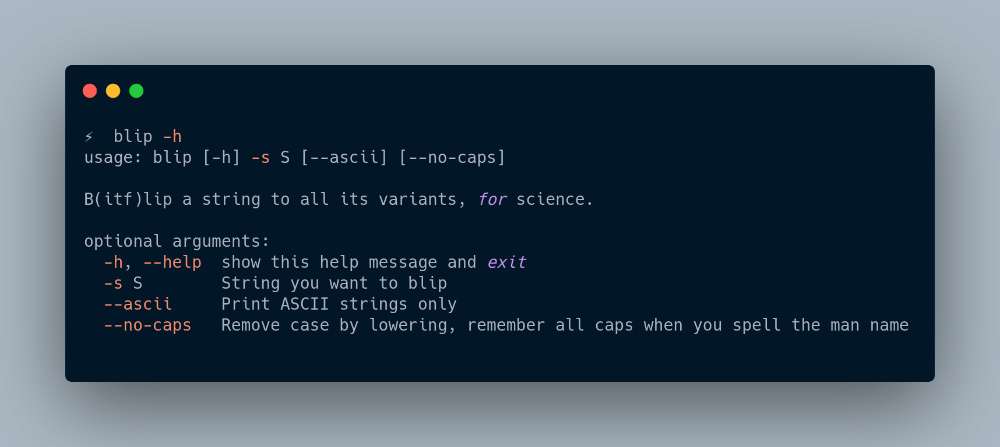

# blip

B(itf)lip Strings for Red Teaming/Bug Bounty Hunting



## Install

`pip install blip`

OR

`git clone https://github.com/zmallen/blip && cd blip && python setup.py install`

## Summary of tool/bitflipping

Bitflipping is a natural phenomena where bits in a packet sometimes 'flip' from 0 to 1, or 1 to 0. Typically, machines that interpret packets use checksums in order to validate the integrity of the datagram as it reads it from a socket. Other times, machines assume the original packet with the bitflip error is what was intended by the computer!

Bitsquatting is an attack thats been around for close to a decade. The concept here is that someone can change bits in a string and then register a domain in order to take advantage of this error, and perhaps direct a victim to a maliciously owned bitsquatted domain. In 2021, a [blog post](https://remyhax.xyz/posts/bitsquatting-windows/) by Remy Hax detailed an attack on the 'Windows' string by bitsquatting domains that weren't owned by Microsoft. This led to some hilarious results as machines from all over the world resolved their infrastructure and tried to communicate it.

I wanted to write a tool to aid researchers and red teamers in generating these strings. Since bitsquatting is specifically related to bitflipped domains, I wanted to focus on the strings that are bitflipped for multiple uses, not just domain registrations. Also, I liked the word 'blip' which is short for bitflip. Bquat didnt sound as good ;)

## Usage

1. `blip -s microsoft` Generate all bitflipped strings for Microsoft
2. `blip -s microsoft --ascii` Generate ASCII-only bitflipped strings
3. `blip -s microsoft --no-caps` Lowercase all candidate strings and remove uppercase characters

## Use Cases

### Generate bitflipped strings to make some bitsquat domain candidates

Install `idn` package (on Ubuntu, `apt install idn`)

```
⚡  blip -s paypal --no-cap | grep -v '[^a-zA-Z\d\s]' | idn
paypad
paypcl
paypql
paqpal
xn--paypl-0qa
paypil
paypal
xn--papal-2ua
pqypal
peypal
piypal
payral
payqal
taypal
xn--paypa-xsa
raypal
xn--aypal-hta
paypah
pcypal
payxal
xn--payal-kta
paypan
paxpal
paypam
qaypal
paipal
paytal
xn--pypal-xqa
paypel
xaypal
```

